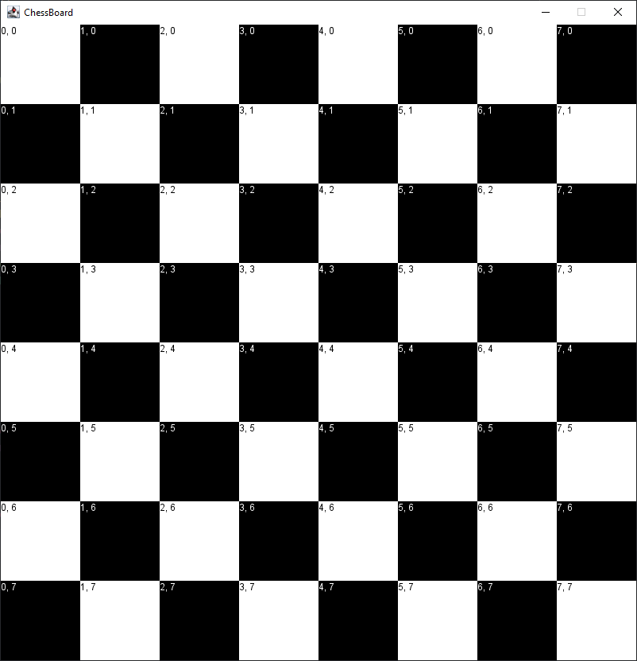
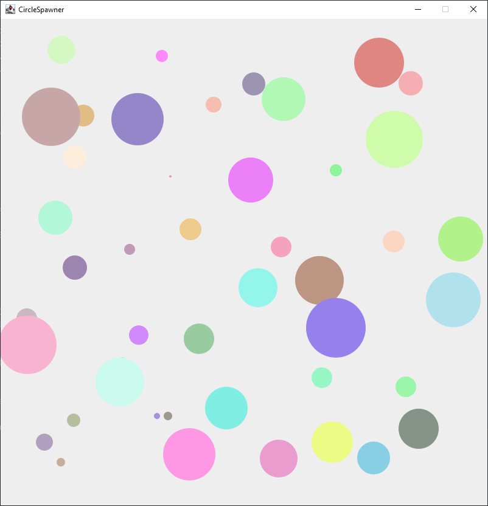
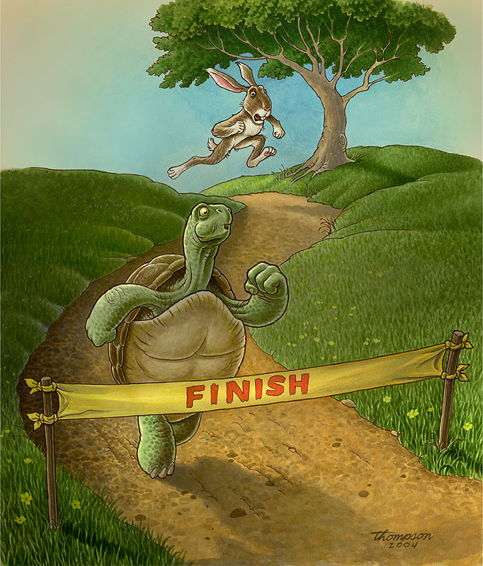

# Zusatzübung Datenstrukturen

## Wichtige Informationen zur Bearbeitung der Aufgabe 

 - [Informationen zur Entwicklungsumgebung *IntelliJ IDEA*](https://elearning.uni-regensburg.de/mod/book/view.php?id=1480675)
 - [Informationen zum Im- und Export von Projekten](https://elearning.uni-regensburg.de/mod/book/view.php?id=1480675&chapterid=51551)
 - [GraphicsApp](https://elearning.uni-regensburg.de/mod/url/view.php?id=1482162)

## Starterpaket

Ein vorbereitetes Starterpaket zur selbständigen Implementierung der Aufgaben finden Sie hier:
 - [Starterpaket](https://github.com/OOP-Ubungen-WS2020-21/Zusatzuebung_Datenstrukturen/archive/Starterpaket.zip)

### Chessboard

Erstellen Sie mittels der `GraphicsApp` ein Schachbrett. Dieses besteht aus 8*8 Feldern, die abwechselnd schwarz und weiß gefärbt sind.
Verwenden Sie ein Zweidimensionales Array (Array aus Arrays) um das Brett zu erzeugen.
Für Werte wie die Größe der Felder sind bereits geeignete Konstanten definiert. 
  

#### Optional

Fügen Sie den einzelnen Feldern zusätzlich Labels hinzu, die die Indexpositionen des jeweiligen Feldes beschreiben.

### CircleSpawner

Erstellen Sie eine Anwendung, in der durch Mausklick Kreise hinzugefügt und entfernt werden können. Verwenden Sie dafür eine ArrayList. Die Kreise sollen an der Position des Mausklicks mit zufälliger Farbe und einem zufälligen Radius zwischen 5 und 50 erzeugt werden. Bei einem Klick auf einem Kreis, soll dieser aus der Liste entfernt werden. Das Verhalten bei einem Klick, müssen Sie lediglich in der Methode `handleClick(float xPos, float yPos)` implementieren.
 

### AnimalRace
 

Vorgegeben ist die Klasse `AnimalRace`. Implementieren Sie ergänzend folgende Klassenhierarchie:

* Es gibt eine Klasse für ein Tier. Jedes Tier hat eine Größe in Zentimetern, eine Geschwindigkeit und einen Namen. Die Instanzvariablen werden über einen passenden Konstruktor belegt. Ein Tier kann sich vorstellen (durch eine Textausgabe), indem es seinen Namen und die Tierart ausgibt. Außerdem können sie ein Rennen laufen, wobei die Streckenlänge über einen Parameter angegeben wird. Zurückgegeben wird dann die Zeit die das Tier braucht, um die gegebene Strecke zurückzulegen. Abschließend soll die Anzahl aller Instanzen der Tier-Klasse in einer passenden statischen Variable gezählt werden. Von der Klasse Tier kann keine Instanz erstellt werden.
* Eine Klasse Hase erbt von Tier. Der Hase hat, im Gegensatz zu anderen Tieren, eine Fellfarbe. Außerdem schläft ein Hase nach Laufen einer bestimmten Distanz ein. Er kann das Rennen dann entsprechend nicht abschließen. Ein Hase erwähnt bei der Vorstellung zusätzlich seine Fellfarbe.
* Eine Klasse Schildkröte erbt von Tier. Die Schildkröte hat einen Panzer mit einem bestimmten Durchmesser. Eine Schildkröte kann schreckhaft sein - dann versteckt sie sich beim Startschuss in ihrem Panzer und braucht 10 Sekunden länger um die Strecke zu überwinden.
 

In der Klasse `AnimalRace` sollen Sie nun das Rennen simulieren. Dafür erstellen Sie zunächst in der `initialize`-Methode jeweils eine Instanz der beiden Tiere. 
Anschließend starten Sie das Rennen. Dafür sollen Sie zunächst die Anzahl aller Teilnehmer ausgeben und sie sich vorstellen lassen. Anschließend beginnt das Rennen. Ermitteln Sie den Gewinner und geben Sie eine Rangliste mit Namen und Platz der Tiere aus.

#### Optional

Ermöglichen Sie die Teilnahme einer beliebigen Anzahl von Tieren.
